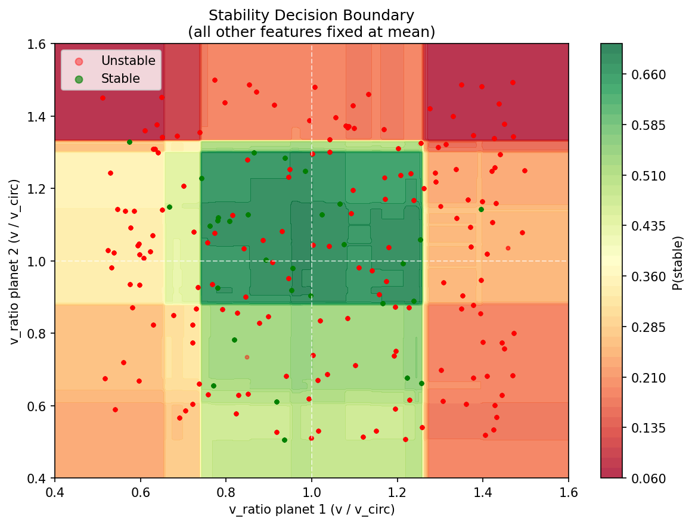

# N-Body Stability Classifier

A machine learning classifier that predicts whether a 3-body gravitational system
will remain stable, built on top of a custom N-body physics simulation engine.

## Overview

The N-body problem describes the motion of N objects under mutual gravitational
attraction. For N >= 3, the system is generally chaotic - tiny differences in
initial conditions lead to wildly different trajectories over time.

This project asks a coarser question: given the initial conditions of a 3-body
system, can a machine learning model predict whether the system will remain stable
over a fixed time horizon? Rather than predicting exact trajectories (which chaos
makes impossible), the model predicts a binary outcome - stable or unstable -
from initial conditions alone.

This is motivated by a real scientific use case: determining long-term stability
of planetary systems traditionally requires running expensive full simulations. A
fast ML surrogate that approximates stability from initial conditions could
significantly speed up parameter space exploration.

## Project Structure

    nbody-stability/
        simulation/
            constants.py            gravitational constant
            system.py               NBodySystem class
            physics.py              vectorized force computation
            integrator.py           velocity Verlet integrator
        experiments/
            generate_dataset.py     random system generator and batch simulator
            generate_run.py         single simulation runner
            label_dataset.py        stability labeling from trajectories
            build_features.py       feature engineering
            train_model.py          model training and evaluation
            plot_boundary.py        decision boundary visualization
            run_single.py           animated single simulation viewer
        data/                       generated data (not tracked in git)
        notebooks/
            inspect_dataset.ipynb
        requirements.txt

## Physics Engine

The simulation uses velocity Verlet integration, a second-order method that
conserves energy better than simple Euler integration and is standard for orbital
mechanics simulations.

Gravitational acceleration is computed using vectorized NumPy operations across
all body pairs simultaneously, replacing nested Python loops for significant
performance improvement.

A system is labeled unstable if any planet escapes beyond 5x its initial orbital
radius, or if any two bodies collide below a collision threshold. Otherwise it is
labeled stable.

## Machine Learning

Features computed from initial conditions only:

- r1, r2 - orbital radius of each planet
- v1, v2 - speed of each planet
- v_ratio1, v_ratio2 - ratio of actual speed to circular orbit speed (v / v_circ)
- separation - initial distance between the two planets

The most informative feature is the velocity ratio. Systems where both planets
start near circular orbit speed (v_ratio close to 1.0) tend to be stable, while
large deviations indicate likely instability.

Models trained:

- Logistic Regression (baseline)
- Random Forest (primary model)

Both use class_weight='balanced' to handle the natural class imbalance - most
randomly generated 3-body systems are unstable.

Results: Random Forest achieves ~89% accuracy with 100% recall on stable systems,
at the cost of some false positives on unstable systems.

## Decision Boundary

The plot shows predicted stability probability as a function of velocity ratio for
both planets, with all other features fixed at their mean values. The green region
corresponds to high P(stable), centered near v_ratio of 1.0 for both planets.
Misclassified points near the boundary correspond to physically ambiguous systems
where chaos makes prediction fundamentally difficult.

## Limitations

- Features are computed from initial conditions only, no trajectory history
- Stability is defined over a fixed time horizon (T = 5000 steps), not infinite time
- The dataset is naturally imbalanced toward unstable systems
- The decision boundary is approximate near the chaos boundary, which is expected

## Setup

    python3 -m venv .venv
    source .venv/bin/activate
    pip install -r requirements.txt

## Usage

    # generate dataset
    PYTHONPATH=. python experiments/generate_dataset.py

    # label simulations
    PYTHONPATH=. python experiments/label_dataset.py

    # build features
    PYTHONPATH=. python experiments/build_features.py

    # train models
    PYTHONPATH=. python experiments/train_model.py

    # visualize decision boundary
    PYTHONPATH=. python experiments/plot_boundary.py

    # run animated single simulation
    PYTHONPATH=. python experiments/run_single.py

## Requirements

- Python 3.9+
- numpy
- matplotlib
- scikit-learn
- tqdm
